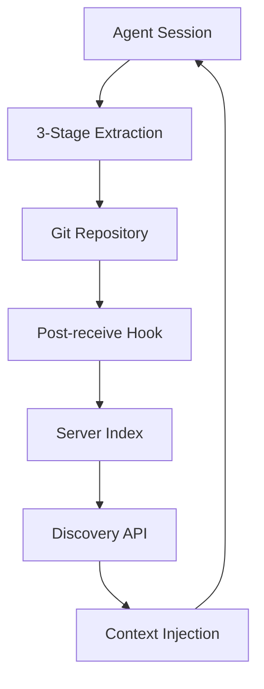

# Architecture

Mycelium is a **client-server knowledge extraction and injection system** that automatically captures procedural knowledge from agent sessions and makes it available for future use.

## System Overview

Mycelium consists of two primary components:

- **Client** (`kinoko run`) — Extracts knowledge from local agent sessions and stores them as Skills
- **Server** (`kinoko serve`) — Indexes extracted Skills and provides discovery APIs

The system uses **Git as the source of truth** with SQLite databases as derived caches for performance.

```
┌─────────────────┐    Git Push    ┌─────────────────┐
│   Client Side   │ ─────────────→ │   Server Side   │
│  kinoko run     │                │  kinoko serve   │
│                 │                │                 │
│ • Extract       │                │ • Index         │
│ • Queue         │                │ • Search        │
│ • Inject        │   ← HTTP ─    │ • Embed         │
└─────────────────┘   Discover     └─────────────────┘
```

## Data Flow

The complete knowledge lifecycle follows this path:

1. **Session** → Agent performs work, produces artifacts
2. **Extraction (Client)** → 3-stage pipeline extracts procedural knowledge
3. **Git Push** → Extracted Skills committed to Git repositories
4. **Post-receive Hook** → Server automatically indexes new Skills
5. **Index (Server)** → Skills stored in SQLite with embeddings
6. **Discover (Client)** → Client queries server for relevant Skills
7. **Injection** → Relevant Skills injected into new agent contexts



## Client Architecture

The client handles knowledge extraction and context injection:

### Core Components

- **Extraction Pipeline** (`internal/extraction/`) — 3-stage process:
  1. **Stage 1**: Metadata filtering (file types, sizes, patterns)
  2. **Stage 2**: Content pattern matching (code blocks, procedures)  
  3. **Stage 3**: LLM critic evaluation (7-dimensional quality rubric)

- **Queue System** (`internal/queue/`) — SQLite-backed task queue for extraction jobs
- **Injection Engine** (`internal/injection/`) — Retrieves and integrates relevant Skills
- **Server Client** (`internal/serverclient/`) — HTTP client for server APIs

### Database: Client Queue DB

The client maintains a local SQLite database for:
- Extraction job queue and status tracking
- Session metadata and artifact references
- Injection history and outcome tracking

**Location**: `~/.kinoko/queue.db`

**Purpose**: Work coordination and local state management. This is **not** the source of truth — Git repositories are.

## Server Architecture  

The server provides indexing, search, and discovery services:

### Core Components

- **API Layer** (`internal/api/`) — HTTP endpoints for client communication
- **Storage Layer** (`internal/storage/`) — SQLite-backed search and indexing
- **Git Server** (`internal/gitserver/`) — Git repository management
- **Decay System** (`internal/decay/`) — Quality scoring based on retrospective signals

### Database: Server Index DB

The server maintains a SQLite database for:
- Skill metadata and content indexing
- Embedding vectors for semantic search
- Quality scores and decay metrics
- Repository and artifact tracking

**Location**: Configurable, typically `~/.kinoko/index.db`

**Purpose**: Fast search and discovery. This is a **derived cache** — Git repositories contain the authoritative Skill content.

## API Surface

The server exposes exactly **6 HTTP endpoints**:

```http
GET   /api/v1/health                    # Health check and status
POST  /api/v1/discover                  # Unified knowledge discovery
POST  /api/v1/embed                     # Embedding generation service
POST  /api/v1/ingest                    # Post-receive hook trigger
GET   /api/v1/skills/decay              # List Skills by decay score  
PATCH /api/v1/skills/{id}/decay         # Update decay scores
```

### Primary API: POST /api/v1/discover

The discover endpoint is the **unified query interface** that replaced multiple specialized endpoints. It handles:

- **Semantic search** via embeddings
- **Pattern-based filtering** 
- **Library scoping**
- **Quality thresholding**

**Request**:
```json
{
  "prompt": "How to create pivot tables with pandas",
  "embedding": [0.1, 0.2, ...],           // optional
  "patterns": ["pivot_table", "DataFrame"], // optional  
  "library_ids": ["pandas-skills"],        // optional
  "min_quality": 0.8,                     // optional
  "top_k": 3                              // optional, max 10
}
```

**Response**:
```json
{
  "skills": [
    {
      "id": "skill-123",
      "name": "Pandas Pivot Table Creation",
      "repo": "pandas-skills", 
      "quality": 0.95,
      "similarity": 0.87,
      "ssh_url": "git@github.com:user/pandas-skills.git",
      "patterns": ["pivot_table", "DataFrame.pivot"]
    }
  ]
}
```

### Supporting APIs

- **POST /api/v1/embed** — Standalone embedding generation for clients that want to cache vectors
- **POST /api/v1/ingest** — Triggered by Git post-receive hooks to index new Skills  
- **GET /api/v1/skills/decay** — Lists Skills sorted by decay score for quality management
- **PATCH /api/v1/skills/{id}/decay** — Updates decay scores based on retrospective signals

## Git as Source of Truth

All extracted knowledge lives in **Git repositories**:

- **One repository per Skill** — clean separation and independent versioning
- **Standard structure** — `SKILL.md`, optional `scripts/`, `templates/`, `references/`
- **Post-receive hooks** — automatic indexing when new Skills are pushed
- **Branching support** — Skills can be versioned, forked, and merged

### Why Git-First?

1. **Durability** — Git provides robust, distributed storage
2. **Versioning** — Skills evolve over time, Git tracks all changes  
3. **Collaboration** — Standard Git workflows for Skill improvement
4. **Auditing** — Full history of what was extracted, when, and why
5. **Recovery** — SQLite databases can be rebuilt from Git at any time

The SQLite databases on both client and server are **derived caches** for performance. Git repositories are the authoritative source.

## Design Rationale

### Client/Server Split

**Why separate client and server?**

- **Extraction needs session data** — Session artifacts, local context, and file system access are inherently client-local
- **Discovery needs global index** — Search across all extracted knowledge requires centralized indexing
- **Different scaling characteristics** — Many clients can share one server; extraction is I/O bound, search is CPU/memory bound
- **Security boundaries** — Client handles sensitive session data, server only sees sanitized extracted knowledge

### Git-First Architecture  

**Why Git instead of direct database storage?**

- **Write path**: `Session → Extract → Git → Hook → Index → SQLite`
- **Read path**: `Query → SQLite → Results` (fast)
- **Truth**: Git repositories (durable, versioned, recoverable)
- **Cache**: SQLite databases (fast, derived, replaceable)

This pattern ensures durability while maintaining performance. The server's SQLite index can always be rebuilt from Git.

### Unified Discover Endpoint

The original system had **15 endpoints** across different query patterns (`/search`, `/match`, `/novelty`, `/discover`). The current design consolidates to **one query endpoint** that handles all discovery use cases:

- **Injection queries** — "What Skills are relevant for this context?"
- **Novelty checks** — "Do we already have Skills like this?" 
- **General search** — "Find Skills matching these criteria"

**Benefits**:
- Simpler client implementation — one API to learn
- Consistent query semantics across all use cases
- Better caching and optimization opportunities
- Easier testing and maintenance

**Research basis**: Based on SkillsBench findings that **focused queries outperform comprehensive approaches**. One well-designed endpoint beats many specialized ones.

### MaxSkills=3, Compact Format

**Why limit to 3 Skills per injection?**

Research from SkillsBench shows that **2-3 Skills provide optimal improvement** (+18.6pp), while 4+ Skills show diminishing returns (+5.9pp). More Skills create "cognitive overhead and conflicting guidance."

**Why compact format over comprehensive documentation?**

SkillsBench data shows **comprehensive Skills hurt performance** (-2.9pp) while detailed/compact Skills help (+18.8pp). Agents struggle to extract relevant information from lengthy content.

**Implementation**:
- Hard cap of 3 Skills per `discover` query (`top_k` max is 10, but injection uses max 3)
- Extraction targets 1.5K tokens per Skill (detailed tier)
- Critic prompt penalizes verbosity without substance

### No MCP (Model Context Protocol)

**Why file-based + hooks + Git instead of MCP?**

- **Platform coverage** — File system + Git work everywhere; MCP requires platform-specific integration
- **Simplicity** — Standard Git workflows are well-understood; MCP adds protocol complexity
- **Durability** — Files persist across sessions; MCP context is ephemeral
- **Debugging** — File contents are inspectable; MCP exchanges are harder to audit
- **Performance** — Local file access is faster than protocol round-trips

The system achieves MCP-like functionality (context augmentation, knowledge sharing) through proven, universal mechanisms.

## Performance Characteristics

### Extraction Pipeline

- **Stage 1** (metadata): ~10ms per session, 80% rejection rate
- **Stage 2** (patterns): ~100ms per candidate, 60% rejection rate  
- **Stage 3** (LLM critic): ~2s per candidate, 40% rejection rate
- **Overall**: ~95% rejection, ~5% become Skills

### Discovery API

- **Embedding lookup**: ~5ms (SQLite with proper indexing)
- **Similarity search**: ~20ms for 10k Skills, ~200ms for 100k Skills
- **Full query**: <100ms for typical workloads

### Storage Requirements

- **Client queue DB**: ~10MB per 1000 sessions
- **Server index DB**: ~50MB per 1000 Skills (including embeddings)
- **Git repositories**: ~2KB per Skill (median SKILL.md size)

## Deployment Patterns

### Single-User Development

```bash
# Terminal 1: Start server  
kinoko serve --port 8080

# Terminal 2: Run extraction
kinoko run --server http://localhost:8080
```

### Team Setup  

- **Shared server** — One instance indexes all team members' Skills
- **Individual clients** — Each developer runs their own `kinoko run`
- **Shared Git remotes** — Skills pushed to team-accessible repositories

### Production Deployment

- **Server**: Long-running service with persistent SQLite database
- **Clients**: Ephemeral, session-based execution
- **Git**: Reliable remote repositories (GitHub, GitLab, self-hosted)
- **Monitoring**: Health endpoint, decay score metrics, extraction success rates

---

*See [CONTRIBUTING.md](../CONTRIBUTING.md) for development workflow and [design-rationale.md](design-rationale.md) for detailed architectural decisions.*