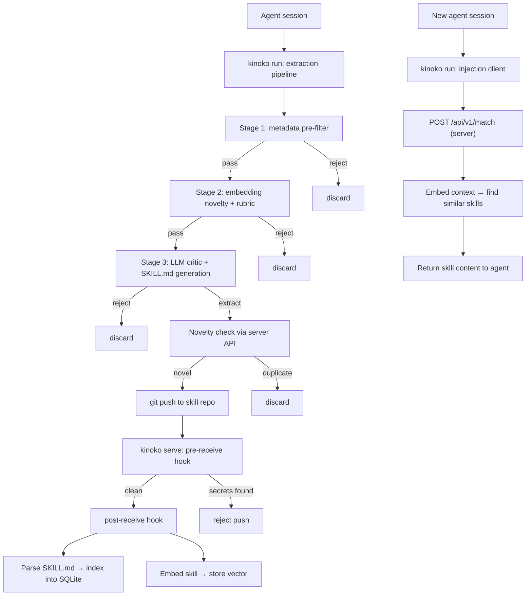

## Three Commands

Kinoko is built around three commands, each with a clear responsibility:

| Command | Role | What it runs |
|---------|------|-------------|
| `kinoko init` | **Setup** | Creates workspace, config, client SSH key, cache directory |
| `kinoko serve` | **Infrastructure** | Git server, embedding engine, APIs, hooks, SQLite indexer |
| `kinoko run` | **Agent daemon** | Worker pool, scheduler, extraction pipeline, injection client |

This separation means the shared infrastructure can run on one machine while multiple developers each run their own local daemon.

## End-to-End Data Flow

From agent session to injected knowledge:



## What Runs Where

### `kinoko serve` — Shared Infrastructure

The server is pure infrastructure. It doesn't run extraction — it hosts data, runs embeddings, and provides APIs:

- **Soft Serve git server** (SSH) — the source of truth for all skills
- **Embedding engine** (ONNX, `bge-small-en-v1.5`) — all embedding runs server-side, clients stay pure Go
- **Novelty API** — `POST /api/v1/novelty` checks if a skill is too similar to existing ones
- **Match API** — `POST /api/v1/match` finds relevant skills for a given context
- **Health/Discovery API** — `GET /api/v1/health`, `GET /api/v1/discover`
- **Pre-receive hook** — credential scanning, rejects pushes with secrets
- **Post-receive hook** — parses SKILL.md, embeds content, indexes into SQLite
- **SQLite + vec extension** — derived cache for fast vector search; git is the write path

### `kinoko run` — Local Agent Daemon

The daemon runs alongside your AI agents on your machine:

- **Worker pool** — picks up session logs and runs the extraction pipeline (Stages 1→2→3)
- **Injection client** — queries the server match API and injects skill content into agent sessions
- **Scheduler** — periodic decay cycles, stale sweeps, stats

This is where extraction intelligence lives. The heavy LLM calls happen here, distributing compute across clients rather than concentrating it on the server.

### `kinoko init` — One-time Setup

Sets up the workspace. Run once per machine:

- Creates `~/.kinoko/` with config, cache dir, and client SSH key
- With `--connect <url>`, configures as a client of a remote server
- Without `--connect`, defaults to `localhost:23231` for solo use

## Port Layout

`kinoko serve` listens on three consecutive ports from a single `--port` flag (default `23231`):

| Port | Service | Protocol |
|------|---------|----------|
| Port (23231) | Soft Serve git server | SSH |
| Port+1 (23232) | Soft Serve HTTP / TUI | HTTP |
| Port+2 (23233) | Kinoko API (match, novelty, health) | HTTP |

All three share the same base. Change `--port 9000` and you get SSH on 9000, HTTP on 9001, API on 9002.

## Git-First Architecture

A key architectural decision: **git is the source of truth**, everything else is derived.

- Each skill lives in its own git repo on the server (repo-per-skill)
- SQLite is a cache — blow it away and rebuild from git at any time
- Embeddings are stored in SQLite vec but can be re-generated from skill content
- The security boundary is the git server (pre-receive hooks scan for credentials)
- Skills have full version history, branching, and independent versioning

This means:
- `kinoko serve --reindex` rebuilds the entire index from git
- No data loss if SQLite corrupts — git is the recovery path
- Skills can be forked, overridden, and layered like Docker images

## Server-Side Embeddings

Embedding runs **only on the server**, using ONNX Runtime with `bge-small-en-v1.5`:

- **Why server-side:** keeps `kinoko run` (the client) as a pure Go binary with zero native dependencies
- **Model:** `bge-small-en-v1.5` (~127MB ONNX, 384-dim vectors) — downloaded automatically on first `kinoko serve` start
- **Storage:** `~/.kinoko/models/bge-small-en-v1.5/` (model.onnx, tokenizer.json, libonnxruntime.so)
- **Vector search:** SQLite vec extension, cosine similarity

Clients call the server's novelty and match APIs over HTTP — they never touch embedding models directly.

## Deployment Patterns

### Solo

Everything on one machine. Simplest setup.

```bash
kinoko init
kinoko serve    # terminal 1
kinoko run      # terminal 2
```

### Team

One server, multiple developers.

**Server machine:**
```bash
kinoko init
kinoko serve
```

**Each developer's machine:**
```bash
kinoko init --connect server-host:23231
kinoko run
```

Each developer's `run` daemon extracts knowledge locally (bearing the LLM cost) and pushes to the shared server. Injection pulls from the same shared pool.

## Degraded Mode

`kinoko run` gracefully degrades when API keys or services are missing:

| Missing | Effect |
|---------|--------|
| LLM key | Extraction disabled; scheduler + injection still work |
| Server unreachable | Novelty check fails open (skills still extracted); injection disabled |
| Both | Scheduler only (decay, stats) |

This means you can start using Kinoko immediately and add API keys later.
